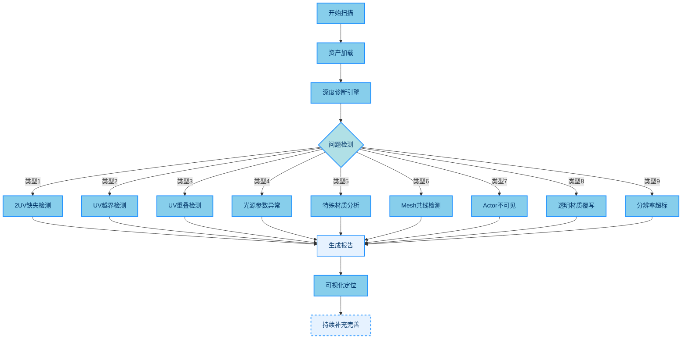

```mermaid
graph TD
  A[开始扫描]:::blueNode --> B[资产加载]
  B --> C[深度诊断引擎]
  C --> D{问题检测}:::diamond
  D -->|类型1| E[2UV缺失检测]
  D -->|类型2| F[UV越界检测]
  D -->|类型3| G[UV重叠检测]
  D -->|类型4| H[光源参数异常]
  D -->|类型5| I[特殊材质分析]
  D -->|类型6| J[Mesh共线检测]
  D -->|类型7| K[Actor不可见]
  D -->|类型8| L[透明材质覆写]
  D -->|类型9| M[分辨率超标]
  E --> N[生成报告]:::report
  F --> N
  G --> N
  H --> N
  I --> N
  J --> N
  K --> N
  L --> N
  M --> N
  N --> O[可视化定位]:::action
  O --> P[持续补充完善]:::special
  style P stroke:#1E90FF,stroke-width:2px,stroke-dasharray:5 5,fill:#E6F2FF

  classDef blueNode fill:#87CEEB,stroke:#1E90FF,stroke-width:2px,color:#003366
  classDef diamond fill:#B0E0E6,stroke:#1E90FF,stroke-width:2px,color:#003366
  classDef report fill:#E6F2FF,stroke:#1E90FF,stroke-width:1.5px,color:#003366
  classDef action fill:#87CEEB,stroke:#1E90FF,stroke-width:2px,color:#003366
  classDef special fill:#F0F8FF,stroke:#1E90FF,stroke-width:2px,color:#003366
  
  class A,B,C,E,F,G,H,I,J,K,L,M,N,O blueNode;
  class D diamond;
  class N report;
  class O action;
  class P special;
```