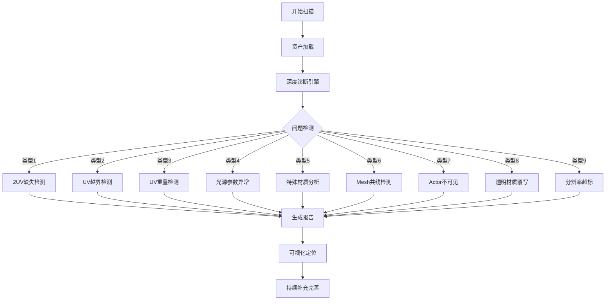

```mermaid
graph TD
  A[开始扫描]:::lightBlue --> B[资产加载]:::lightBlue
  B --> C[深度诊断引擎]:::lightBlue
  C --> D{问题检测}:::decision
  D -->|类型1| E[2UV缺失检测]:::lightBlue
  D -->|类型2| F[UV越界检测]:::lightBl
  D -->|类型3| G[UV重叠检测]:::lightBlue
  D -->|类型4| H[光源参数异常]:::lightBlue
  D -->|类型5| I[特殊材质分析]:::lightBlue
  D -->|类型6| J[Mesh共线检测]:::lightBlue
  D -->|类型7| K[Actor不可见]:::lightBlue
  D -->|类型8| L[透明材质覆写]:::lightBlue
  D -->|类型9| M[分辨率超标]:::lightBlue
  E --> N[生成报告]:::report
  F --> N
  G --> N
  H --> N
  I --> N
  J --> N
  K --> N
  L --> N
  M --> N
  N --> O[可视化定位]:::lightBlue
  O --> P[持续补充完善]

```