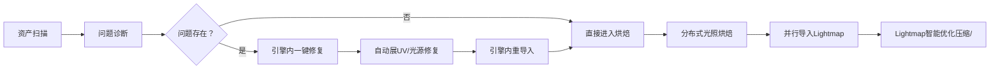

```mermaid
graph LR
    A[资产扫描] --> B[问题诊断]
    B --> C{问题存在？}
    C -->|是| D[引擎内一键修复]
    C -->|否| E[直接进入烘焙]
    D --> F[自动展UV/光源修复]
    F --> G[引擎内重导入]
    G --> E
    E --> H[分布式光照烘焙]
    H --> I[并行导入Lightmap]
    I --> J[Lightmap智能优化压缩/]
```