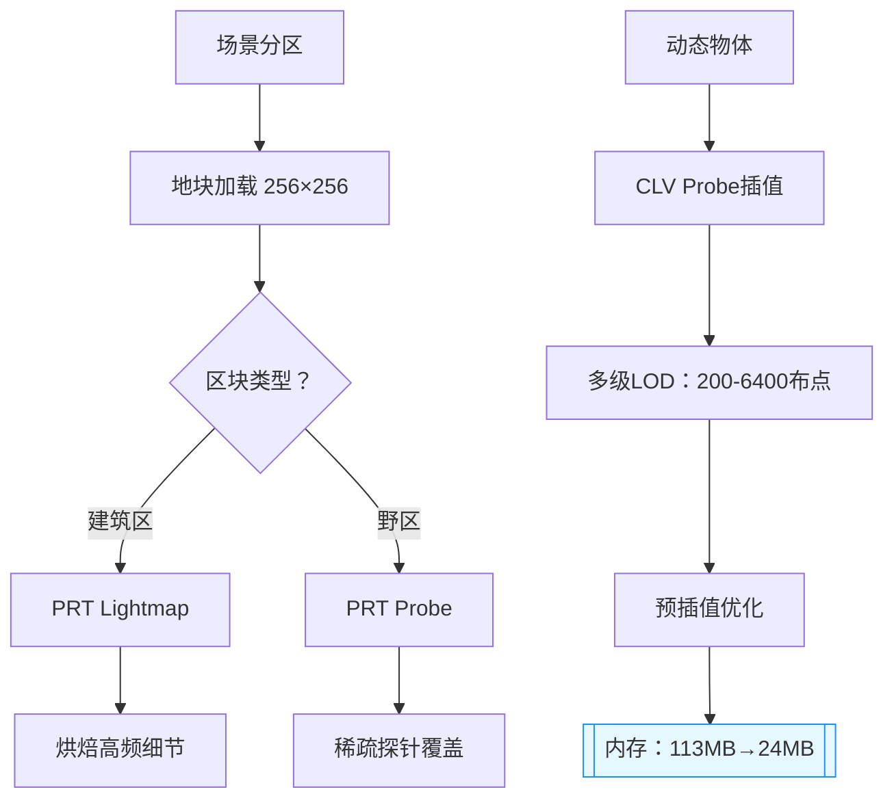

```mermaid
graph TD
    A[场景分区] --> B[地块加载 256×256]
    B --> C{区块类型？}
    C -->|建筑区| D[PRT Lightmap]
    C -->|野区| E[PRT Probe]
    D --> F[烘焙高频细节]
    E --> G[稀疏探针覆盖]
    H[动态物体] --> I[CLV Probe插值]
    I --> J[多级LOD：200-6400布点]
    J --> K[预插值优化]
    K --> L[[内存：113MB→24MB]]
    style L fill:#e6f7ff,stroke:#1890ff
```