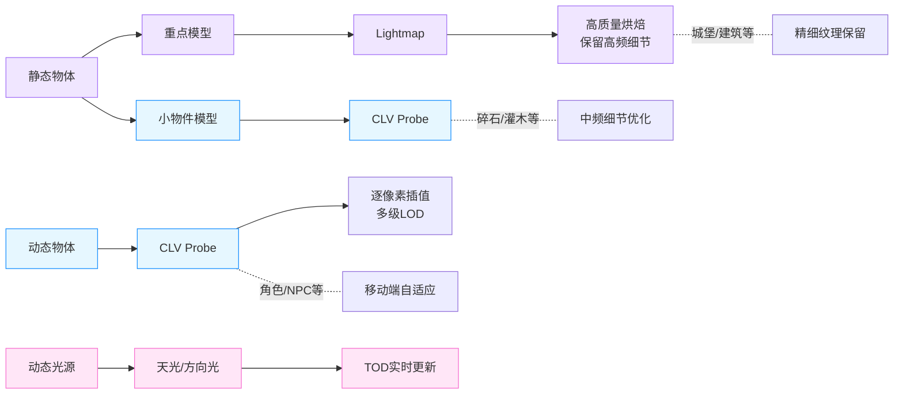

```mermaid
graph LR
    %% 静态物体分区
    A[静态物体] --> A1[重点模型] --> A11[Lightmap]
    A11 --> A111[高质量烘焙<br>保留高频细节]
    A --> A2[小物件模型] --> A21[CLV Probe]
    
    %% 动态物体（与小物件共用CLV体系）
    B[动态物体] --> B1[CLV Probe]
    B1 --> B11[逐像素插值<br>多级LOD]
    
    %% 动态光源保持不变
    C[动态光源] --> C1[天光/方向光]
    C1 --> C11[TOD实时更新]
    
    %% 技术说明增强
    A111 -.- |城堡/建筑等| H[精细纹理保留]
    A21 -.- |碎石/灌木等| I[中频细节优化]
    B1 -.- |角色/NPC等| J[移动端自适应]
    
    %% 统一CLV相关色系
    classDef clvStyle fill:#e6f7ff,stroke:#1890ff
    class A2,A21,B,B1 clvStyle
    
    %% 保持原图配色
    classDef staticStyle fill:#f0e6ff,stroke:#a370f7
    class A,A1,A11,A111 staticStyle
    
    classDef lightStyle fill:#ffe6f7,stroke:#f770d0
    class C,C1,C11 lightStyle
```