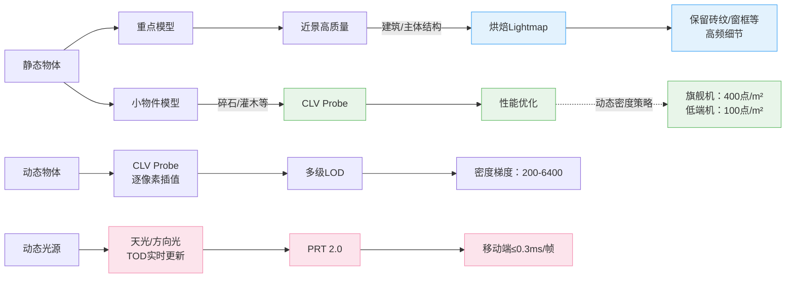

```mermaid
graph LR
    %% ===== 静态物体-分层优化 =====
    A[静态物体] --> A1[重点模型]
    A1 --> A11[近景高质量]
    A11 -->|建筑/主体结构| A111[烘焙Lightmap]
    A111 --> A1111[保留砖纹/窗框等<br>高频细节]
    
    A --> A2[小物件模型]
    A2 -->|碎石/灌木等| A21[CLV Probe]
    A21 --> A211[性能优化]
    A211 -.->|动态密度策略| A2111[旗舰机：400点/m²<br>低端机：100点/m²]
    
    %% ===== 动态部分保持核心逻辑 =====
    B[动态物体] --> B1[CLV Probe<br>逐像素插值]
    B1 --> B11[多级LOD]
    B11 --> B111[密度梯度：200-6400]
    
    C[动态光源] --> C1[天光/方向光<br>TOD实时更新]
    C1 --> C11[PRT 2.0]
    C11 --> C111[移动端≤0.3ms/帧]
    
    %% ===== 洛克王国特化标注 =====
    style A111 fill:#e3f2fd,stroke:#42a5f5
    style A21 fill:#e8f5e9,stroke:#66bb6a
    style C1 fill:#fce4ec,stroke:#f48fb1
    
    classDef highQuality fill:#e3f2fd,stroke:#42a5f5
    classDef optimized fill:#e8f5e9,stroke:#66bb6a
    classDef realtime fill:#fce4ec,stroke:#f48fb1
    class A111,A1111 highQuality
    class A21,A211,A2111 optimized
    class C1,C11,C111 realtime
```