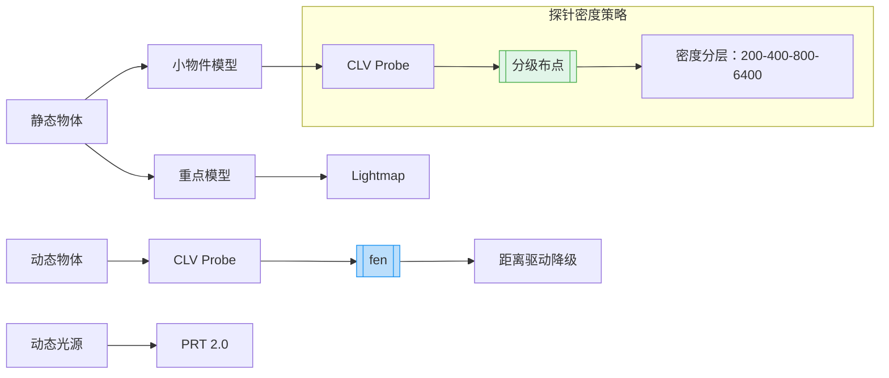

```mermaid
graph LR
  %% 保留原基础框架
  A[静态物体] --> A1[重点模型] --> A2[Lightmap]
  A --> B[小物件模型] --> B1[CLV Probe]
  
  %% 新增分级标注
  subgraph 探针密度策略
    B1 --> C[[分级布点]]
    C --> C1["密度分层：200-400-800-6400"]
    style C fill:#e1f5e8,stroke:#4caf50
  end
  
  %% 动态部分严格区分
  D[动态物体] --> D1[CLV Probe] 
  D1 --> D2[[fen]] 
  D2 --> D3[距离驱动降级]
  style D2 fill:#bbdefb,stroke:#2196f3
  
  E[动态光源] --> E1[PRT 2.0]
```