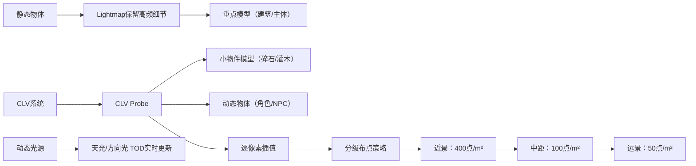

```mermaid
graph LR
    %% ===== 静态物体（独立处理）=====
    A[静态物体] --> A1[Lightmap保留高频细节]
    A1 --> A2["重点模型（建筑/主体）"]

    %% ===== 动态系统（小物件与动态物体合并）=====
    B[CLV系统] --> B1[CLV Probe]
    B1 --> B2["小物件模型（碎石/灌木）"]
    B1 --> B3["动态物体（角色/NPC）"]
    B1 --> B4[逐像素插值]
    B4 --> B5["分级布点策略"]
    B5 --> B6["近景：400点/m²"]
    B6 --> B7["中距：100点/m²"]
    B7 --> B8["远景：50点/m²"]

    %% ===== 动态光源（保持不变）=====
    C[动态光源] --> C1["天光/方向光 TOD实时更新"]

```